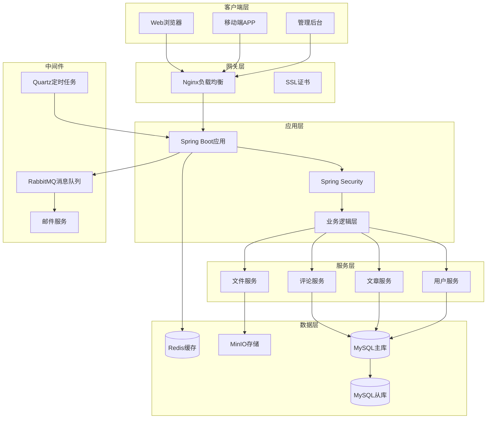

# 🌸 Haibara Blog Backend

<div align="center">


**🚀 基于 Spring Boot 3 + Vue 3 开发的现代化个人博客系统后端**

*一个功能完善、架构清晰、代码优雅的企业级博客系统*

[📖 在线演示](https://your-blog.com) | [📚 API文档](https://your-blog.com/doc.html) | [🐛 问题反馈](https://github.com/Haibara406/haibara-blog/issues)

---

</div>

## 📖 项目简介

**Haibara Blog Backend** 是一个功能完善、架构清晰的现代化博客系统后端服务。项目采用最新的 **Spring Boot 3** 技术栈，结合 **MyBatis Plus**、**Spring Security**、**Redis** 等主流技术，构建了一个高性能、高可用、易扩展的企业级博客平台。

> 💡 **设计理念**：追求代码的优雅与简洁，注重系统的可维护性与扩展性，提供完整的企业级解决方案。

### ✨ 核心特性

#### 🏗️ **架构设计**
- 🎯 **分层架构**：Controller → Service → Mapper 清晰分层
- 🔧 **模块化设计**：功能模块独立，低耦合高内聚
- 📦 **组件化开发**：可复用组件，提高开发效率
- 🔄 **异步处理**：RabbitMQ 消息队列，提升系统性能

#### 🔐 **安全防护**
- 🛡️ **JWT认证**：无状态认证，支持分布式部署
- 👥 **RBAC权限**：基于角色的访问控制，细粒度权限管理
- 🚫 **接口限流**：防止恶意请求，保护系统稳定
- 🔒 **黑名单机制**：IP黑名单，自动封禁恶意用户
- 🛡️ **XSS防护**：输入验证，防止跨站脚本攻击

#### 📝 **内容管理**
- 📄 **文章系统**：支持 Markdown，草稿箱，定时发布
- 🏷️ **分类标签**：多级分类，标签云，内容组织
- 💬 **评论系统**：多级评论，邮件通知，审核机制
- 📝 **留言板**：访客留言，管理员回复
- 🌳 **树洞功能**：匿名分享，情感表达
- ❤️ **点赞收藏**：用户互动，内容推荐

#### 🎨 **用户体验**
- 📱 **响应式设计**：适配多端设备
- 🌙 **主题切换**：明暗主题，个性化定制
- 🔍 **全文搜索**：ElasticSearch 集成（可选）
- 📊 **数据统计**：访问统计，用户行为分析
- 🎵 **多媒体支持**：图片、音频、视频上传

#### 🚀 **性能优化**
- ⚡ **Redis缓存**：多级缓存策略，提升响应速度
- 🔄 **数据库优化**：索引优化，查询优化，避免N+1问题
- 📦 **CDN集成**：静态资源加速
- 🗜️ **数据压缩**：Gzip压缩，减少传输量
- 📈 **监控告警**：系统监控，性能分析

#### 🛠️ **开发运维**
- 📚 **API文档**：Knife4j 自动生成，在线调试
- 📝 **操作日志**：完整的操作审计
- 🔍 **链路追踪**：请求链路跟踪，问题定位
- 🐳 **容器化**：Docker 支持，一键部署
- 🔧 **配置管理**：多环境配置，动态配置更新

## 🏗️ 技术架构

### 🎯 核心技术栈

<table>
<tr>
<td>

**🔧 核心框架**
-  核心框架
-  安全框架
-  Web框架
-  面向切面编程

</td>
<td>

**🗄️ 数据存储**
-  主数据库
-  缓存数据库
-  ORM框架
-  连接池

</td>
</tr>
<tr>
<td>

**🔧 工具组件**
-  API文档
-  代码简化
-  JSON处理
-  参数校验

</td>
<td>

**🚀 中间件**
-  消息队列
-  对象存储
-  定时任务
-  认证令牌

</td>
</tr>
</table>

### 📊 技术选型说明

| 技术 | 版本 | 选型理由 | 核心功能 |
|------|------|----------|----------|
| **Spring Boot** | 3.1.4 | 🚀 最新稳定版，原生支持GraalVM | 自动配置、依赖注入、Web服务 |
| **Spring Security** | 6.x | 🔐 企业级安全框架，功能完善 | JWT认证、权限控制、安全防护 |
| **MyBatis Plus** | 3.5.x | ⚡ 增强MyBatis，提高开发效率 | CRUD操作、分页查询、代码生成 |
| **MySQL** | 8.0+ | 🗄️ 成熟稳定，性能优异 | 数据持久化、事务支持、主从复制 |
| **Redis** | 7.0+ | ⚡ 高性能缓存，丰富数据结构 | 缓存、会话存储、分布式锁 |
| **RabbitMQ** | 3.x | 📨 可靠消息传递，支持多种模式 | 异步处理、邮件发送、日志记录 |
| **MinIO** | Latest | 📦 兼容S3，部署简单 | 文件存储、图片上传、静态资源 |
| **Knife4j** | 4.x | 📚 美观易用，功能丰富 | API文档、在线调试、接口测试 |

### 🏛️ 系统架构图



### 🔧 项目结构

```
blog-backend/
├── 📁 src/main/java/com/blog/
│   ├── 📁 annotation/          # 自定义注解
│   │   ├── AccessLimit.java    # 接口限流注解
│   │   ├── CheckBlacklist.java # 黑名单检查注解
│   │   └── LogAnnotation.java  # 操作日志注解
│   ├── 📁 aop/                 # 切面编程
│   │   └── LogAspect.java      # 日志切面
│   ├── 📁 config/              # 配置类
│   │   ├── Knife4jConfig.java  # API文档配置
│   │   ├── SecurityConfiguration.java # 安全配置
│   │   ├── RedisConfig.java    # Redis配置
│   │   ├── MybatisPlusConfig.java # MyBatis Plus配置
│   │   └── QuartzConfig.java   # 定时任务配置
│   ├── 📁 constants/           # 常量定义
│   ├── 📁 controller/          # 控制器层
│   │   ├── ArticleController.java    # 文章管理
│   │   ├── UserController.java       # 用户管理
│   │   ├── MenuController.java       # 菜单管理
│   │   ├── PermissionController.java # 权限管理
│   │   └── ...                       # 其他控制器
│   ├── 📁 domain/              # 领域对象
│   │   ├── 📁 dto/             # 数据传输对象
│   │   ├── 📁 entity/          # 实体类
│   │   ├── 📁 vo/              # 视图对象
│   │   └── 📁 response/        # 响应对象
│   ├── 📁 enums/               # 枚举类
│   ├── 📁 exceptions/          # 异常处理
│   ├── 📁 filter/              # 过滤器
│   ├── 📁 handler/             # 处理器
│   ├── 📁 interceptor/         # 拦截器
│   ├── 📁 mapper/              # 数据访问层
│   ├── 📁 service/             # 业务逻辑层
│   │   └── 📁 impl/            # 业务实现类
│   ├── 📁 utils/               # 工具类
│   └── 📁 quartz/              # 定时任务
├── 📁 src/main/resources/
│   ├── application.yml         # 主配置文件
│   ├── application-dev.yml     # 开发环境配置
│   ├── application-prod.yml    # 生产环境配置
│   └── 📁 mapper/              # MyBatis映射文件
├── 📁 sql/                     # 数据库脚本
├── 📄 Dockerfile              # Docker构建文件
├── 📄 docker-compose.yml      # Docker编排文件
└── 📄 pom.xml                 # Maven配置文件
```

## 🚀 快速开始

### 📋 环境要求

| 环境 | 版本要求 | 说明 |
|------|----------|------|
|  | **17+** | 推荐使用 OpenJDK 17 或 Oracle JDK 17 |
|  | **3.6+** | 项目构建工具 |
|  | **8.0+** | 主数据库，支持JSON字段 |
|  | **7.0+** | 缓存数据库 |
|  | **2.0+** | 版本控制工具 |

> 💡 **推荐开发环境**：IntelliJ IDEA 2023+ / Eclipse 2023+ / VS Code

### 🛠️ 本地开发

#### 1️⃣ 克隆项目

```bash
# 克隆仓库
git clone https://github.com/Haibara406/haibara-blog.git

# 进入后端目录
cd haibara-blog/blog-backend

# 查看项目结构
tree -L 3
```

#### 2️⃣ 数据库初始化

```sql
-- 1. 创建数据库
CREATE DATABASE haibara_blog
CHARACTER SET utf8mb4
COLLATE utf8mb4_unicode_ci;

-- 2. 创建用户（可选）
CREATE USER 'blog_user'@'localhost' IDENTIFIED BY 'your_password';
GRANT ALL PRIVILEGES ON haibara_blog.* TO 'blog_user'@'localhost';
FLUSH PRIVILEGES;

-- 3. 导入数据库脚本
USE haibara_blog;
SOURCE sql/haibara_blog.sql;

-- 4. 验证表结构
SHOW TABLES;
```

#### 3️⃣ 配置文件设置

创建开发环境配置文件：

```bash
# 复制配置模板
cp src/main/resources/application.yml src/main/resources/application-dev.yml
```

修改 `application-dev.yml` 配置：

```yaml
# 服务器配置
server:
  port: 8080
  servlet:
    context-path: /

# 数据源配置
spring:
  profiles:
    active: dev

  # 数据库配置
  datasource:
    driver-class-name: com.mysql.cj.jdbc.Driver
    url: jdbc:mysql://localhost:3306/haibara_blog?useUnicode=true&characterEncoding=utf8&serverTimezone=Asia/Shanghai&useSSL=false&allowPublicKeyRetrieval=true
    username: blog_user
    password: your_password
    hikari:
      minimum-idle: 5
      maximum-pool-size: 20
      connection-timeout: 30000
      idle-timeout: 600000
      max-lifetime: 1800000

  # Redis配置
  redis:
    host: localhost
    port: 6379
    password: your_redis_password
    database: 0
    timeout: 5000ms
    lettuce:
      pool:
        max-active: 8
        max-idle: 8
        min-idle: 0
        max-wait: -1ms

# MyBatis Plus配置
mybatis-plus:
  configuration:
    log-impl: org.apache.ibatis.logging.stdout.StdOutImpl
  global-config:
    db-config:
      logic-delete-field: isDeleted
      logic-delete-value: 1
      logic-not-delete-value: 0

# 日志配置
logging:
  level:
    com.blog: debug
    org.springframework.security: debug
```

#### 4️⃣ 启动应用

<details>
<summary>📖 <strong>方式一：IDE启动（推荐）</strong></summary>

1. 使用 IntelliJ IDEA 打开项目
2. 等待 Maven 依赖下载完成
3. 找到 `BlogBackendApplication.java` 主类
4. 右键选择 `Run 'BlogBackendApplication'`

</details>

<details>
<summary>📖 <strong>方式二：Maven命令启动</strong></summary>

```bash
# 清理并编译
mvn clean compile

# 启动应用（开发模式）
mvn spring-boot:run -Dspring-boot.run.profiles=dev

# 或者指定JVM参数
mvn spring-boot:run -Dspring-boot.run.jvmArguments="-Xmx512m -Dspring.profiles.active=dev"
```

</details>

<details>
<summary>📖 <strong>方式三：打包启动</strong></summary>

```bash
# 打包应用（跳过测试）
mvn clean package -DskipTests

# 运行JAR包
java -jar target/blog-backend-0.0.1-SNAPSHOT.jar --spring.profiles.active=dev

# 或指定JVM参数
java -Xmx512m -Dspring.profiles.active=dev -jar target/blog-backend-0.0.1-SNAPSHOT.jar
```

</details>

#### 5️⃣ 验证启动

启动成功后，访问以下地址验证：

| 服务 | 地址 | 说明 |
|------|------|------|
| 🏠 **应用首页** | http://localhost:8062 | 应用根路径 |
| 📚 **API文档** | http://localhost:8062/doc.html | Knife4j接口文档 |
| ❤️ **健康检查** | http://localhost:8062/actuator/health | Spring Boot健康检查 |
| 📊 **应用信息** | http://localhost:8062/actuator/info | 应用详细信息 |
| 🔧 **配置信息** | http://localhost:8062/actuator/configprops | 配置属性（需认证） |

> ✅ **启动成功标志**：控制台输出 `Started BlogBackendApplication in X.XXX seconds`

### 🐳 Docker 部署

#### 1️⃣ 环境变量配置

创建 `.env` 文件：

```bash
# 数据库配置
MYSQL_ROOT_PASSWORD=your_strong_password
MYSQL_DATABASE=haibara_blog
MYSQL_USER=blog_user
MYSQL_PASSWORD=your_mysql_password

# Redis配置
REDIS_PASSWORD=your_redis_password

# 应用配置
JWT_SECRET=your_jwt_secret_key_at_least_32_characters
SPRING_PROFILES_ACTIVE=prod

# MinIO配置
MINIO_ROOT_USER=your_minio_access_key
MINIO_ROOT_PASSWORD=your_minio_secret_key

# RabbitMQ配置
RABBITMQ_DEFAULT_USER=admin
RABBITMQ_DEFAULT_PASS=your_rabbitmq_password
```

#### 2️⃣ 构建镜像

```bash
# 构建应用镜像
docker build -t haibara-blog-backend:latest .

# 查看构建的镜像
docker images | grep haibara-blog-backend

# 或使用 docker-compose 构建
docker-compose build --no-cache
```

#### 3️⃣ 启动服务

```bash
# 启动所有服务（后台运行）
docker-compose up -d

# 查看服务状态
docker-compose ps

# 查看实时日志
docker-compose logs -f

# 查看特定服务日志
docker-compose logs -f blog-backend
docker-compose logs -f mysql
docker-compose logs -f redis
```

#### 4️⃣ 服务管理

```bash
# 停止所有服务
docker-compose down

# 停止并删除数据卷
docker-compose down -v

# 重启特定服务
docker-compose restart blog-backend

# 进入容器
docker-compose exec blog-backend bash
docker-compose exec mysql mysql -u root -p

# 查看容器资源使用情况
docker stats
```

## 📚 功能模块

### 🔐 用户认证与授权

<details>
<summary><strong>🔑 认证功能</strong></summary>

- **JWT认证**：无状态认证，支持分布式部署
- **多端登录**：Web端、移动端统一认证
- **OAuth集成**：支持GitHub、Gitee等第三方登录
- **密码安全**：BCrypt加密，密码强度验证
- **登录保护**：登录失败锁定，验证码防护

</details>

<details>
<summary><strong>👥 权限管理</strong></summary>

- **RBAC模型**：用户-角色-权限三层模型
- **细粒度控制**：接口级权限控制
- **动态权限**：支持运行时权限变更
- **权限继承**：角色权限继承机制
- **数据权限**：基于部门、用户的数据隔离

</details>

### 📝 内容管理系统

<details>
<summary><strong>📄 文章管理</strong></summary>

- **富文本编辑**：支持Markdown编辑器
- **草稿箱**：自动保存，防止数据丢失
- **定时发布**：支持文章定时发布
- **文章分类**：多级分类，便于内容组织
- **标签系统**：标签云，内容标记
- **SEO优化**：自动生成摘要、关键词

</details>

<details>
<summary><strong>💬 互动功能</strong></summary>

- **评论系统**：多级评论，支持回复
- **点赞收藏**：用户互动，内容推荐
- **留言板**：访客留言，管理员回复
- **树洞功能**：匿名分享，情感表达
- **邮件通知**：评论、回复自动通知

</details>

### 🛡️ 安全防护

<details>
<summary><strong>🔒 安全机制</strong></summary>

- **接口限流**：防止恶意请求，保护系统稳定
- **IP黑名单**：自动封禁恶意IP
- **XSS防护**：输入验证，防止跨站脚本攻击
- **CSRF防护**：跨站请求伪造防护
- **SQL注入防护**：参数化查询，防止SQL注入
- **敏感词过滤**：内容审核，维护社区环境

</details>

### 📊 系统监控

<details>
<summary><strong>📈 监控功能</strong></summary>

- **系统监控**：CPU、内存、磁盘使用率
- **接口监控**：响应时间、成功率统计
- **用户行为**：访问统计、用户画像
- **操作日志**：完整的操作审计
- **异常告警**：系统异常自动通知
- **性能分析**：慢查询分析，性能优化

</details>

## 🔧 API 文档

### 📖 接口文档

项目集成了 **Knife4j**，提供美观易用的API文档界面：

- **在线文档**：http://localhost:8080/doc.html
- **接口测试**：支持在线调试
- **参数说明**：详细的请求/响应参数
- **示例代码**：多语言示例代码生成

### 🎯 核心接口

| 模块 | 接口路径 | 说明 |
|------|----------|------|
| **用户认证** | `/auth/**` | 登录、注册、OAuth |
| **用户管理** | `/user/**` | 用户信息、权限管理 |
| **文章管理** | `/article/**` | 文章CRUD、分类标签 |
| **评论系统** | `/comment/**` | 评论管理、回复功能 |
| **文件上传** | `/upload/**` | 图片、文件上传 |
| **系统管理** | `/system/**` | 菜单、角色、权限 |

### 📝 接口规范

```json
// 统一响应格式
{
  "code": 200,
  "message": "操作成功",
  "data": {},
  "timestamp": "2024-01-01T12:00:00"
}

// 分页响应格式
{
  "code": 200,
  "message": "查询成功",
  "data": {
    "records": [],
    "total": 100,
    "size": 10,
    "current": 1,
    "pages": 10
  }
}
```

## 🗄️ 数据库设计

### 📊 核心表结构

<details>
<summary><strong>👤 用户相关表</strong></summary>

```sql
-- 用户表
sys_user (id, username, nickname, email, avatar, password, gender, status, create_time, update_time)

-- 角色表
sys_role (id, role_name, role_key, status, order_num, create_time, update_time)

-- 权限表
sys_permission (id, permission_desc, permission_key, menu_id, create_time, update_time)

-- 用户角色关联表
sys_user_role (id, user_id, role_id)

-- 角色权限关联表
sys_role_permission (id, role_id, permission_id)
```

</details>

<details>
<summary><strong>📝 内容相关表</strong></summary>

```sql
-- 文章表
t_article (id, title, content, summary, cover, category_id, user_id, status, view_count, like_count, create_time, update_time)

-- 分类表
t_category (id, category_name, description, order_num, create_time, update_time)

-- 标签表
t_tag (id, tag_name, color, create_time, update_time)

-- 文章标签关联表
t_article_tag (id, article_id, tag_id)

-- 评论表
t_comment (id, content, article_id, parent_id, user_id, reply_user_id, status, create_time, update_time)
```

</details>

### 🔍 索引优化

```sql
-- 文章表索引
CREATE INDEX idx_article_category ON t_article(category_id);
CREATE INDEX idx_article_user ON t_article(user_id);
CREATE INDEX idx_article_status ON t_article(status);
CREATE INDEX idx_article_create_time ON t_article(create_time);

-- 评论表索引
CREATE INDEX idx_comment_article ON t_comment(article_id);
CREATE INDEX idx_comment_parent ON t_comment(parent_id);
CREATE INDEX idx_comment_user ON t_comment(user_id);

-- 用户角色索引
CREATE INDEX idx_user_role_user ON sys_user_role(user_id);
CREATE INDEX idx_user_role_role ON sys_user_role(role_id);
```

## ⚙️ 配置说明

### 🔧 核心配置

<details>
<summary><strong>📊 数据源配置</strong></summary>

```yaml
spring:
  datasource:
    # 数据库连接配置
    driver-class-name: com.mysql.cj.jdbc.Driver
    url: jdbc:mysql://localhost:3306/haibara_blog?useUnicode=true&characterEncoding=utf8&serverTimezone=Asia/Shanghai
    username: ${DB_USERNAME:blog_user}
    password: ${DB_PASSWORD:your_password}

    # HikariCP连接池配置
    hikari:
      minimum-idle: 5                # 最小空闲连接数
      maximum-pool-size: 20          # 最大连接池大小
      connection-timeout: 30000      # 连接超时时间(毫秒)
      idle-timeout: 600000           # 空闲超时时间(毫秒)
      max-lifetime: 1800000          # 连接最大生命周期(毫秒)
      leak-detection-threshold: 60000 # 连接泄漏检测阈值
```

</details>

<details>
<summary><strong>🔴 Redis配置</strong></summary>

```yaml
spring:
  redis:
    host: ${REDIS_HOST:localhost}
    port: ${REDIS_PORT:6379}
    password: ${REDIS_PASSWORD:}
    database: ${REDIS_DATABASE:0}
    timeout: 5000ms

    # Lettuce连接池配置
    lettuce:
      pool:
        max-active: 8    # 最大连接数
        max-idle: 8      # 最大空闲连接数
        min-idle: 0      # 最小空闲连接数
        max-wait: -1ms   # 最大等待时间
```

</details>

<details>
<summary><strong>🔐 安全配置</strong></summary>

```yaml
# JWT配置
jwt:
  secret: ${JWT_SECRET:your_jwt_secret_key_at_least_32_characters}
  expiration: 86400000  # 24小时(毫秒)
  refresh-expiration: 604800000  # 7天(毫秒)

# 安全配置
security:
  # 接口限流配置
  rate-limit:
    enabled: true
    default-limit: 100    # 默认限制次数
    default-window: 60    # 时间窗口(秒)

  # 黑名单配置
  blacklist:
    enabled: true
    auto-ban: true        # 自动封禁
    ban-threshold: 10     # 封禁阈值
```

</details>

### 📁 文件上传配置

```yaml
# 文件上传配置
file:
  upload:
    # 本地存储配置
    local:
      enabled: false
      path: /data/uploads/
      url-prefix: /uploads/

    # MinIO配置
    minio:
      enabled: true
      endpoint: ${MINIO_ENDPOINT:http://localhost:9000}
      access-key: ${MINIO_ACCESS_KEY:minioadmin}
      secret-key: ${MINIO_SECRET_KEY:minioadmin}
      bucket-name: ${MINIO_BUCKET:haibara-blog}

    # 文件限制
    max-file-size: 10MB
    max-request-size: 50MB
    allowed-types: jpg,jpeg,png,gif,pdf,doc,docx
```

## 🚀 生产部署

### 🌐 生产环境配置

<details>
<summary><strong>🔧 生产配置优化</strong></summary>

```yaml
# application-prod.yml
server:
  port: 8062
  compression:
    enabled: true
    mime-types: text/html,text/xml,text/plain,text/css,text/javascript,application/javascript,application/json
    min-response-size: 1024

spring:
  profiles:
    active: prod

  # 数据源配置
  datasource:
    hikari:
      minimum-idle: 10
      maximum-pool-size: 50
      connection-timeout: 20000
      idle-timeout: 300000
      max-lifetime: 1200000

  # JPA配置
  jpa:
    show-sql: false
    hibernate:
      ddl-auto: none

# 日志配置
logging:
  level:
    root: INFO
    com.blog: INFO
  file:
    name: logs/haibara-blog.log
  logback:
    rollingpolicy:
      max-file-size: 100MB
      max-history: 30

# 监控配置
management:
  endpoints:
    web:
      exposure:
        include: health,info,metrics,prometheus
  endpoint:
    health:
      show-details: when-authorized
```

</details>

### 🐳 Docker Compose 生产配置

```yaml
# docker-compose.prod.yml
version: '3.8'

services:
  blog-backend:
    image: haibara-blog-backend:latest
    container_name: haibara-blog-backend
    restart: unless-stopped
    environment:
      - SPRING_PROFILES_ACTIVE=prod
      - DB_HOST=mysql
      - REDIS_HOST=redis
    depends_on:
      - mysql
      - redis
    networks:
      - blog-network
    labels:
      - "traefik.enable=true"
      - "traefik.http.routers.blog-api.rule=Host(`api.yourdomain.com`)"
      - "traefik.http.services.blog-api.loadbalancer.server.port=8080"

  mysql:
    image: mysql:8.0
    container_name: haibara-blog-mysql
    restart: unless-stopped
    environment:
      MYSQL_ROOT_PASSWORD: ${MYSQL_ROOT_PASSWORD}
      MYSQL_DATABASE: ${MYSQL_DATABASE}
      MYSQL_USER: ${MYSQL_USER}
      MYSQL_PASSWORD: ${MYSQL_PASSWORD}
    volumes:
      - mysql_data:/var/lib/mysql
      - ./sql:/docker-entrypoint-initdb.d
    command: --default-authentication-plugin=mysql_native_password
    networks:
      - blog-network

  redis:
    image: redis:7-alpine
    container_name: haibara-blog-redis
    restart: unless-stopped
    command: redis-server --requirepass ${REDIS_PASSWORD}
    volumes:
      - redis_data:/data
    networks:
      - blog-network

  nginx:
    image: nginx:alpine
    container_name: haibara-blog-nginx
    restart: unless-stopped
    ports:
      - "80:80"
      - "443:443"
    volumes:
      - ./nginx/nginx.conf:/etc/nginx/nginx.conf
      - ./nginx/ssl:/etc/nginx/ssl
    depends_on:
      - blog-backend
    networks:
      - blog-network

volumes:
  mysql_data:
  redis_data:

networks:
  blog-network:
    driver: bridge
```

## ❓ 常见问题

### 🔧 开发问题

<details>
<summary><strong>Q: 启动时提示数据库连接失败？</strong></summary>

**A:** 检查以下几点：
1. 确认MySQL服务已启动
2. 检查数据库连接配置是否正确
3. 确认数据库用户权限
4. 检查防火墙设置

```bash
# 检查MySQL服务状态
systemctl status mysql

# 测试数据库连接
mysql -h localhost -u blog_user -p haibara_blog
```

</details>

<details>
<summary><strong>Q: Redis连接超时？</strong></summary>

**A:** 解决方案：
1. 检查Redis服务状态
2. 确认Redis配置文件
3. 检查网络连接

```bash
# 检查Redis服务
systemctl status redis

# 测试Redis连接
redis-cli -h localhost -p 6379 ping
```

</details>

<details>
<summary><strong>Q: 文件上传失败？</strong></summary>

**A:** 检查项：
1. 文件大小是否超过限制
2. 文件类型是否被允许
3. 存储路径权限是否正确
4. MinIO服务是否正常

</details>

### 🚀 部署问题

<details>
<summary><strong>Q: Docker容器启动失败？</strong></summary>

**A:** 排查步骤：
1. 查看容器日志：`docker-compose logs -f`
2. 检查环境变量配置
3. 确认端口是否被占用
4. 检查磁盘空间

</details>

<details>
<summary><strong>Q: 接口响应慢？</strong></summary>

**A:** 优化建议：
1. 检查数据库索引
2. 优化SQL查询
3. 增加Redis缓存
4. 调整连接池配置

</details>

## 🤝 贡献指南

### 📝 贡献流程

1. **Fork** 本仓库
2. **创建** 特性分支 (`git checkout -b feature/AmazingFeature`)
3. **提交** 更改 (`git commit -m 'Add some AmazingFeature'`)
4. **推送** 到分支 (`git push origin feature/AmazingFeature`)
5. **提交** Pull Request

### 📋 代码规范

- **Java代码**：遵循阿里巴巴Java开发手册
- **注释规范**：使用JavaDoc注释
- **命名规范**：驼峰命名法
- **提交信息**：使用语义化提交信息

### 🐛 问题反馈

如果您发现了bug或有功能建议，请：

1. 查看 [Issues](https://github.com/Haibara406/haibara-blog/issues) 是否已存在相关问题
2. 如果没有，请创建新的Issue
3. 详细描述问题或建议
4. 提供复现步骤（如果是bug）

## 📄 许可证

本项目基于 **Apache License 2.0** 许可证开源。

```
Copyright 2024 Haibara

Licensed under the Apache License, Version 2.0 (the "License");
you may not use this file except in compliance with the License.
You may obtain a copy of the License at

    http://www.apache.org/licenses/LICENSE-2.0

Unless required by applicable law or agreed to in writing, software
distributed under the License is distributed on an "AS IS" BASIS,
WITHOUT WARRANTIES OR CONDITIONS OF ANY KIND, either express or implied.
See the License for the specific language governing permissions and
limitations under the License.
```

## 🙏 致谢

感谢以下开源项目的支持：

- [Spring Boot](https://spring.io/projects/spring-boot) - 核心框架
- [MyBatis Plus](https://baomidou.com/) - ORM框架
- [Knife4j](https://doc.xiaominfo.com/) - API文档
- [Redis](https://redis.io/) - 缓存数据库
- [MySQL](https://www.mysql.com/) - 关系型数据库

## 📞 联系方式

- **作者**：Haibara
- **邮箱**：haibara406@gmail.com
- **qq邮箱**：haibaraiii@foxmail.com
- **Gitee**：[@Haibara406](https://gitee.com/haibaraiii)
- **GitHub**：[@Haibara406](https://github.com/Haibara406)

---

<div align="center">

**⭐ 如果这个项目对您有帮助，请给个Star支持一下！**


</div>
```
```